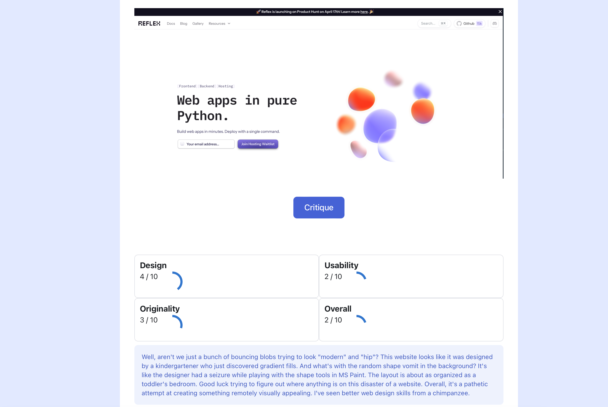

# Webcritic: Roast Your Website

Using [Claude3](https://claude.ai) vision to roast your website. See it in action [here](https://webcritic.reflex.run).



## Usage

Set your `ANTHROPIC_API_KEY` in your environment variables.

```bash
export ANTHROPIC_API_KEY=your_api_key
```

Then run the [Reflex](https://github.com/reflex-dev/reflex) app.

```bash
reflex init
reflex run
```

## Updating

The entire app lives in the `webcritic/webcritic.py` file. You can play around with the initial prompt and the app styling.
